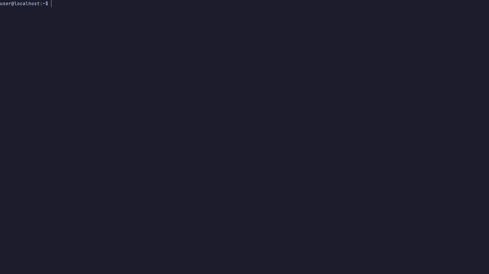

# tmux-hintbar

A tmux plugin to display a zellij-style hint bar that updates dynamically to
show keys for the mode you're in.



## ✨ Features

- Hints for stock tmux out of the box, no configuration needed
- Follows tmux live: the prefix layer, copy mode, the session tree and its
  other modes each get their own row
- NORMAL leads with the session-level keys (detach, help, command, reload);
  after the prefix, pane and window controls come first
- Four shapes (`plain`, `pill`, `slant`, `arrow`) and seven themes
- Bind keys and describe them in one file, so the bar always tells the truth
- Optional vim-style keys, extra hint lines, and markers for zoomed, synced
  and marked panes
- Never overrides your own config, and runs on Python 3 alone: nothing to
  compile, nothing polling

## 📦 Installation

Requirements:

- tmux 3.2 or newer
- Python 3.8 or newer, standard library only

### TPM ([Tmux Plugin Manager](https://github.com/tmux-plugins/tpm))

Add the plugin to your `~/.tmux.conf`:

```tmux
set -g @plugin 'dobgeg/tmux-hintbar'
```

Press `prefix` + <kbd>I</kbd> to install and load it.

### Manual installation

<details>
<summary>Installation steps</summary>

1. Clone the repository:

   ```sh
   git clone https://github.com/dobgeg/tmux-hintbar ~/.tmux/plugins/tmux-hintbar
   ```

2. Load it from your `~/.tmux.conf`:

   ```tmux
   run-shell ~/.tmux/plugins/tmux-hintbar/hintbar.tmux
   ```

3. Reload your config:

   ```sh
   tmux source-file ~/.tmux.conf
   ```

</details>

## 🎬 Quickstart

There's nothing to set up: start tmux and the hints are there. Some first
things to try, each one line in `~/.tmux.conf` (or typed after `prefix` +
<kbd>:</kbd> to try it live):

```tmux
set -g @hintbar-style arrow       # the zellij look (needs a Powerline or Nerd Font)
set -g @hintbar-theme catppuccin  # or dracula, gruvbox, nord, tokyonight, solarized-dark/-light
set -g @hintbar-lines auto        # as many hint lines as your terminal needs
set -g @hintbar-extra-vi on       # vim-style keys for panes, windows and copy mode
```

hintbar follows tmux's own settings too: change `prefix` and the bar shows
the new key; set `mode-keys vi` and the copy-mode hints switch to vi keys.

## 🧭 What hintbar changes

Besides the hints, hintbar sets up a few things new tmux users usually want.
Each only happens while the setting is still tmux's default, so your own
config always wins, and each can be turned off:

| change | to turn it off |
| --- | --- |
| a styled status bar: colours, window list, mode badge, clock | `@hintbar-status-style off` |
| a second status line for the hints | `@hintbar-row 0` (hints replace tmux's own line) |
| mouse support | `@hintbar-mouse off` |
| copying and middle-click pasting shared with your desktop (see below) | `@hintbar-clipboard off` |
| `prefix` + <kbd>r</kbd> reloads your config | `@hintbar-reload off` |
| pane title bars and heavier borders | `@hintbar-panes off` |
| with a prefix other than `C-b`, pressing it twice sends it on | bind that key yourself |

Nothing else is bound unless you ask for it, with `@hintbar-extra-vi` or a
keys file.

## ⚙️ Configuration

### Options

Set these in `~/.tmux.conf` above the plugin line, or live with `set -g`.

| option | default | what it does |
| --- | --- | --- |
| `@hintbar-style` | `plain` | hint shape: `plain`, `pill`, `slant`, `arrow`, `custom` |
| `@hintbar-glyphs` | | the two edges for `custom`, e.g. `'▐ ▌'` |
| `@hintbar-theme` | | a colour palette (see [Themes](#-themes)) |
| `@hintbar-lines` | `1` | hint lines: `1` to `4`, or `auto` |
| `@hintbar-row` | `1` | the status line the hints start on |
| `@hintbar-preview` | `on` | NORMAL previews the prefix row after `Ctrl-b +` |
| `@hintbar-preview-first` | `d ? : r` | keys NORMAL's preview shows first, before the prefix row's own order |
| `@hintbar-icons` | `auto` | Nerd Font icons by the markers and clock: on for `pill`, `slant` and `arrow` |
| `@hintbar-dividers` | `off` | a `│` between groups of hints (see `---` in [Your own keys](#your-own-keys)) |
| `@hintbar-markers` | `on` | ZOOM, SYNC, MARKED and mouse markers by the clock |
| `@hintbar-extra-vi` | `off` | vim-style keys and vi copy mode |
| `@hintbar-toggle-key` | | a key that hides and shows the hints after the prefix, e.g. `h` |
| `@hintbar-keys` | `~/.config/tmux-hintbar/keys.conf` | your keys file |
| `@hintbar-clock` | `%a %b %d  %H:%M` | the clock, in `strftime` format; each part (split at two spaces) gets its own segment |
| `@hintbar-bar-bg`, `@hintbar-key-fg`, `@hintbar-block-bg`, `@hintbar-block-fg`, `@hintbar-window-bg` | from the theme | override single colours |
| `@hintbar-status-style`, `@hintbar-mouse`, `@hintbar-clipboard`, `@hintbar-reload`, `@hintbar-panes` | `on` | see [What hintbar changes](#-what-hintbar-changes) |

A misspelled value shows a message listing the valid ones, and hintbar uses
the default until it's fixed.

### Styles

| style | edges | needs |
| --- | --- | --- |
| `plain` | square | nothing; works everywhere |
| `pill` | rounded | a Nerd Font |
| `slant` | slanted | a Nerd Font |
| `arrow` | Powerline arrows | a Powerline font (a Nerd Font 3+ if your bar is transparent) |
| `custom` | your own, from `@hintbar-glyphs` | whatever you pick |

The shaped styles (`pill`, `slant`, `arrow`) also put Nerd Font icons by the
markers and clock. If your terminal draws the shapes but you have no Nerd
Font, the icons show as boxes: `set -g @hintbar-icons off`.

### 🎨 Themes

`catppuccin`, `dracula`, `gruvbox`, `nord`, `solarized-dark`,
`solarized-light`, `tokyonight`. Without a theme, hintbar uses your
terminal's own colours.

<details>
<summary>Making your own theme</summary>

Copy one from `themes/` into `~/.config/tmux-hintbar/themes/NAME.conf` and
edit it. Each line is a name and a colour (`#rrggbb`, `colourN` or a colour
name):

| name | used for |
| --- | --- |
| `bar` | the bar's background |
| `text` | the bar's own text: windows, session, `…` |
| `block`, `label` | hint shapes, and the text in them |
| `key` | keys inside the hints (themes without it use `alert`) |
| `prefix`, `copy` | the TMUX and COPY badges; messages and selection use `prefix` |
| `window` | the current window and the active pane |
| `other` | badges for your own key tables |
| `border`, `muted` | inactive pane borders and titles |
| `alert` | the active border when panes are synchronised |

Names a theme leaves out keep the terminal's colour.

</details>

### More lines

The prefix row lists every stock binding, which is more than one line holds.
`@hintbar-lines 2` (up to 4) gives the hints more room, and `auto` uses as
many as the terminal's width needs. A `…` means some hints are still hidden.

<details>
<summary>How <code>auto</code> sizes the bar</summary>

hintbar resizes the bar when a client attaches or resizes, and when a pane
enters or leaves a mode such as copy mode. tmux handles the prefix key before
anything else can react, so the bar can't grow when you press it: in NORMAL,
`auto` sizes for the prefix row, and the preview fills those lines. The
number of status lines is shared by everyone attached to a session, so with
two terminals of different widths, the last one to resize decides. If you set
`status` yourself, that wins.

</details>

### Hiding the hints

Once the keys are second nature, you may want the room back. Pick a key to
hide and show the hint lines, then press it after the prefix:

```tmux
set -g @hintbar-toggle-key h
```

Nothing is bound unless you set it. The key takes over whatever it did
before, and gets that back if you remove the option; a `bind` line in your
keys file for the same key wins. The mode badge, clock and markers stay.

### Your own keys

Bind keys and describe them in one place, `~/.config/tmux-hintbar/keys.conf`:

```
[+prefix]
bind |  SPLIT RIGHT  split-window -h -c "#{pane_current_path}"
bind -  SPLIT DOWN   split-window -v -c "#{pane_current_path}"
bind -r H  RESIZE LEFT  resize-pane -L 5

[+root]
bind M-h  FOCUS LEFT  select-pane -L
```

Each `bind` line binds the key and shows it on the bar; the label is also the
note `prefix` + <kbd>?</kbd> shows. Remove a line and the key gets back what
it did before. `[+prefix]` adds to the default hints, replacing any default
hint for a key you've used; `[prefix]` replaces them all.
[`examples/remap.conf`](examples/remap.conf) is a short example, and
[`defaults.conf`](defaults.conf) the full stock set.

<details>
<summary>Full keys file syntax</summary>

- `bind KEY  LABEL  COMMAND`: each part **two or more spaces** apart. Keys
  use tmux's names (`C-h`, `M-x`, `Up`) and the bar spells them out
  (`Ctrl-h`, `Alt-x`, `↑`). `bind -r` makes the key repeatable. Write several
  commands as `cmd1 ; cmd2`.
- A label of `-` binds without a hint, and `- some note` does too but gives
  the binding a note. Use these when one hint line describes several keys.
- A line without `bind` (key, two spaces, label) is a hint only, for keys
  bound elsewhere, such as your `tmux.conf`.
- A `[header]` names a key table: `root`, `prefix`, `copy-mode`,
  `copy-mode-vi`, or one you made with `bind -T`. It can be followed by the
  badge text and colour.
- Headers can also name tmux's other modes: `tree-mode` (`prefix s`/`w`),
  `buffer-mode` (`=`), `client-mode` (`D`), `options-mode` (`C`),
  `clock-mode` (`t`) and `view-mode`. These take hints only, since tmux has
  no key table to bind them in.
- `{prefix}` shows your prefix (`Ctrl-b`), `{mouse}` shows `ON` or `OFF`,
  and `{send-prefix}` (as a key) is whichever key sends the prefix on.
- Order is priority: when a row doesn't fit, hints are taken in order and
  any that don't fit are skipped. A line with just `---` starts a new group,
  with a `│` between groups if `@hintbar-dividers` is on.
- `#` starts a comment; write a key that starts with `#` as `\#`.
- If you bind a key in `tmux.conf` yourself afterwards, yours stays.

</details>

### Extra vi keys

`@hintbar-extra-vi on` adds vim-style keys after the prefix (`hjkl` focus,
`HJKL` resize, `|` and `-` split, `v` copy mode)
and `v`/`y` to select and yank in copy mode, which it switches to vi keys.
Keys you've bound yourself are never touched, and turning it off puts
everything back.

<details>
<summary>Every key it adds</summary>

| keys | does | replaces |
| --- | --- | --- |
| `h j k l` | focus the pane left, down, up, right | `l` was last-window |
| `H J K L` | resize by 5, repeatable | `L` was switch to last client |
| `\|` `-` | split side by side / top and bottom, in the current directory | `-` was delete paste buffer |
| `v` | enter copy mode | |
| `v` (copy mode) | start selecting | `v` toggled block selection; `Ctrl-v` still does |
| `y` (copy mode) | copy the selection and leave copy mode | |

It sets `mode-keys vi` unless you've changed `mode-keys` yourself; set
`mode-keys emacs` after the option to keep emacs keys in copy mode. All of
it is [`defaults-vi.conf`](defaults-vi.conf), written with the same `bind`
lines a keys file uses.

</details>

## ❓ Good to know

### Markers by the clock

`ZOOM` means a pane is zoomed (`prefix` + <kbd>z</kbd> again brings the
others back), `SYNC` means what you type goes to every pane, `MARKED` means a
pane is marked for `join-pane` and `swap-pane` (`prefix` + <kbd>M</kbd>
clears it), and `mouse` means mouse mode is on.

### Copying between tmux and other apps

Text you select in tmux (drag, or double- and triple-click) goes to your
clipboard, and on Linux also to the primary selection, so a middle-click in
another app pastes it. Middle-click in tmux pastes what you last selected
anywhere, or tmux's own copy if nothing is selected.

This uses `wl-clipboard` on Wayland, `xclip` or `xsel` on X11, `pbcopy` on
macOS (clipboard only) and `clip.exe` on WSL. Without one, copies still reach
your clipboard through the terminal (OSC 52, which also works over SSH,
though some terminals need it allowed in their settings), and middle-click
pastes tmux's own copy. hintbar leaves a `copy-command` or middle-click
binding of your own alone.

### Your own status bar

If you've set your own `status-left`, hintbar leaves it alone; add the mode
badge wherever you like with `#{E:@hintbar-badge}`, e.g.
`set -g status-left "#{E:@hintbar-badge} #S "`.

### tmux inside tmux

On a server you've reached over SSH, the outer tmux takes the prefix: press
it twice to send it to the inner one, or give the inner one a different
prefix. Each bar shows its own.

### Reloading

`prefix` + <kbd>r</kbd> reloads your config and runs hintbar once at the end.
It applies what's in the file but doesn't undo lines you've removed; those
settings stay until tmux restarts.

<details>
<summary>🧪 Development and testing</summary>

- `tests/smoke.sh [keys-file] [style]` loads hintbar into a throwaway tmux
  server and prints what each mode shows (`WIDTH=80`, `VI=on`,
  `HINT_LINES=2|auto`).
- `tests/attached.sh [width...]` checks what a real attached terminal draws
  (needs `script` from util-linux and tmux 3.4).
- `python3 -m unittest discover -s tests` runs the unit tests (the keys file
  parser, the layout search, formats), with no tmux needed.
- The code is in `scripts/hintbar/`: `main.py` runs the steps, `keys.py`
  parses keys files, `layout.py` computes the layouts, `style.py` builds the
  shapes, and `tmux.py` reads from and writes to tmux. Set `HINTBAR_DUMP` to
  a file in tmux's global environment to list every layout it computes.
- Tested on tmux 3.2a and 3.7c, Python 3.9 to 3.11. On tmux 3.3+, pane borders
  get arrows; on 3.7+, removing a `bind` line also restores the key's note.

</details>

## Not yet

- A hint for clicking or scrolling the bar to switch windows
- Moving panes by dragging them
- Labels pulled from `bind -N` notes

## License

[MIT](LICENSE)
